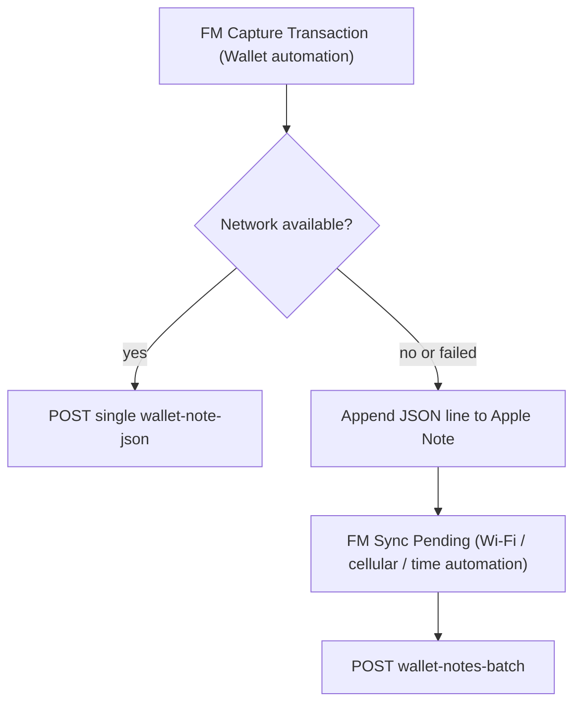

# Apple Shortcuts: Queue-First Transaction Capture

This guide sets up **resilient** Apple Wallet capture that never loses a transaction when offline, and **syncs automatically** with no daily manual taps.

It complements the PWA offline queue. The two queues are independent:

| Queue | Storage | Drains via |
|-------|---------|-----------|
| PWA Quick Add | IndexedDB (in the app) | Automatic in-app sync |
| Shortcuts | Apple Notes | `FM Sync Pending` automation |

Both post to the same backend batch endpoint:
`POST /api/transaction/import/wallet-notes-batch`

---

## How it works



If a POST succeeds (or returns duplicate), nothing is queued. If the network is down or the request fails, the transaction is written to an Apple Note. A separate automation drains that note whenever connectivity returns.

---

## One-time setup

### Shared values

Decide these once and reuse in both shortcuts:

| Variable | Example |
|----------|---------|
| `API_BASE` | `http://YOUR_TAILSCALE_IP:8080/api` |
| `JWT_TOKEN` | Your login token (Bearer) |
| `QUEUE_NOTE_NAME` | `FinanceManager Pending` |

Use `http://` over Tailscale (port 8080 does not serve TLS), or your `tailscale serve` HTTPS URL if configured.

---

## Shortcut A: `FM Capture Transaction`

Replaces the current direct-POST Wallet shortcut.

**Trigger:** your existing Wallet transaction automation.

**Steps:**

1. Build a **Dictionary** with keys:
   - `name`, `merchant`, `amount`, `date`, `location`
   (Use the same values your current shortcut already extracts.)
2. **Get Contents of** `API_BASE/transaction/import/wallet-note-json`
   - Method: `POST`
   - Headers: `Authorization: Bearer JWT_TOKEN`, `Content-Type: application/json`
   - Request Body: JSON = the Dictionary
   - **Important:** set a short timeout and allow the step to fail without stopping the shortcut (toggle off "Stop on error" / wrap as needed)
3. **If** the request succeeded (status `201` or `409`):
   - Done.
4. **Otherwise** (no network, timeout, or 5xx):
   - **Find Notes** where name is `QUEUE_NOTE_NAME` (create it if missing)
   - Convert the Dictionary to a single-line JSON string
   - **Append** that line + a newline to the note
   - **Show Notification:** "Saved offline — will sync automatically"

**Queue format:** one JSON object per line (JSONL).

```json
{"name":"Coffee","merchant":"Tim Hortons","amount":"4.50","date":"2026-06-27","location":""}
```

---

## Shortcut B: `FM Sync Pending`

Drains the Apple Note automatically. **No manual run required.**

**Steps:**

1. **If** there is no network connection → **Stop** (silent).
2. **Find Notes** named `QUEUE_NOTE_NAME`. If empty → **Stop**.
3. Get the note body and **Split Text** by new lines.
4. Filter out blank lines; combine the JSON lines into a **JSON array** (wrap with `[` `]`, join with `,`).
5. **Get Contents of** `API_BASE/transaction/import/wallet-notes-batch`
   - Method: `POST`
   - Headers: `Authorization: Bearer JWT_TOKEN`, `Content-Type: application/json`
   - Request Body: the JSON array
6. Read the response. For every item with status `created` or `duplicate`, remove its line from the note.
   - Simplest robust approach: if `created + duplicates == total`, clear the note. Otherwise keep only the lines whose status was `skipped`.
7. **Show Notification** (only if at least one synced): "Synced N transactions" or "Synced N — M still pending".

### Automations (set up once, run forever)

Create **Personal Automations** that run `FM Sync Pending` with "Ask Before Running" turned **off**:

| Automation | Trigger |
|------------|---------|
| Primary | **When connected to Wi-Fi** (any network) |
| Optional | **When cellular data is enabled** / first network of day |
| Fallback | **Time of Day** — every few hours (e.g. 8am, 2pm, 8pm) |

With these, captured-offline transactions sync without you doing anything.

---

## Auth notes

JWT tokens expire. If `FM Sync Pending` starts returning `401`:

- Log in to the app, copy a fresh token, and update `JWT_TOKEN` in both shortcuts.
- A future app update may add a long-lived, import-only **device token** to avoid this.

---

## Response reference

`POST /api/transaction/import/wallet-notes-batch`

Request body:

```json
[
  {"name":"Coffee","merchant":"Tim Hortons","amount":"4.50","date":"2026-06-27","location":"","categoryId":12},
  {"name":"Lunch","merchant":"Subway","amount":"11.25","date":"2026-06-27","location":""}
]
```

Response:

```json
{
  "total": 2,
  "created": 1,
  "duplicates": 1,
  "skipped": 0,
  "results": [
    {"index": 0, "status": "created", "message": "Transaction saved", "hash": "..."},
    {"index": 1, "status": "duplicate", "message": "Transaction already exists", "hash": "..."}
  ]
}
```

Drain rule: remove items whose status is `created` or `duplicate`. Keep `skipped` for review.

Duplicate detection is by deterministic hash, so retries are always safe.
